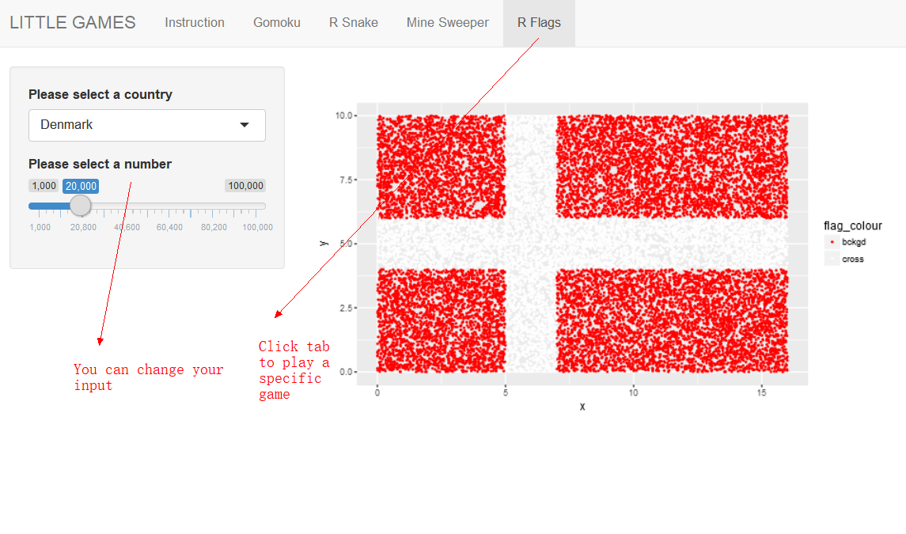

# Shiny App - LittleGames

## Description

1. This is an app consisting of four tiny games: Gomoku, R Snake, Mine Sweeper and R Flags.

2. This shiny app basically has the same content as the LittleGames R package. But changes were made in order to fit these games to a shiny app environment.

3. These four games were modified based on the original functions, which are attached in the individual files. There are also README files in individual folders that specify what changes we made to the original codes.

4. There are instructions for these games. You can read them once you open this app.

## Break Down of Work

Basically, every group member made/modified one or two games.

Wei Wang: R Snake, R Flags

Yimo Zhang: Gomoku

Bowei Wei: Mine Sweeper

## How To Use This App

1. There is five tabs in the main menu, “instruction”, “gomoku”, “r snake”, “mine sweeper” and “r flags”.

2. Click “instruction” to see how to play each game. You can use the submenu to see the instruction of a specific game.

 

3. Click any game to play a specific game.

 

## Note

To make the codes neat, not a lot of comments were put in the combined version of app.R. But you can go through all the details in individual files, including all the functions and comments.

